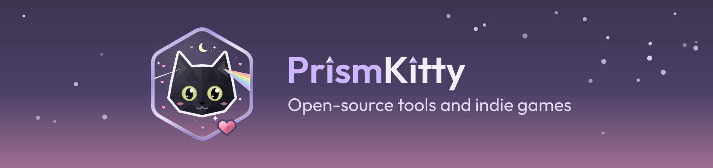

Hi, I'm PrismKitty. I make open-source tools and indie games.

## OpenCode plugins

- [opencode-shortcuts](https://github.com/PrismKitty/opencode-shortcuts) shows every OpenCode keyboard shortcut on one screen and lets you rebind them in place
- [opencode-background-tasks](https://github.com/PrismKitty/opencode-background-tasks) lists the background shells and subagents still running in your session, in the sidebar
